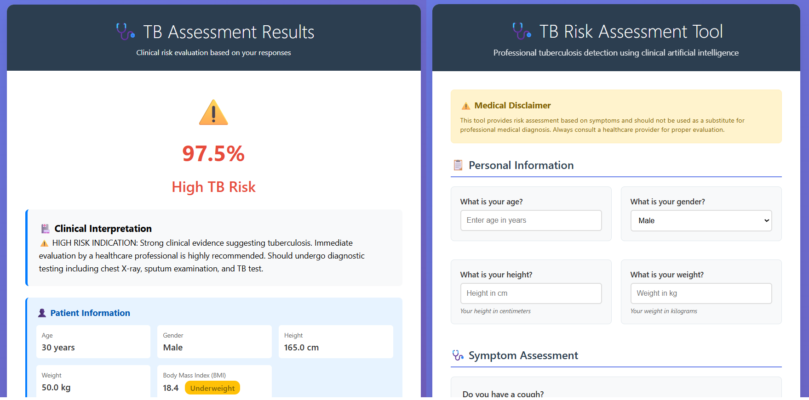
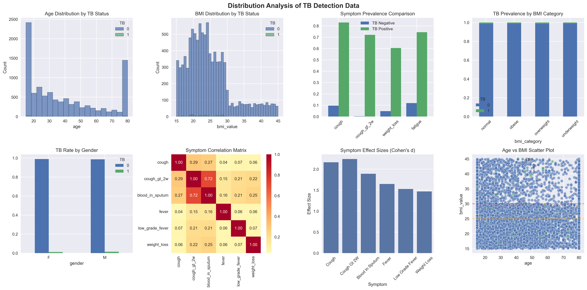
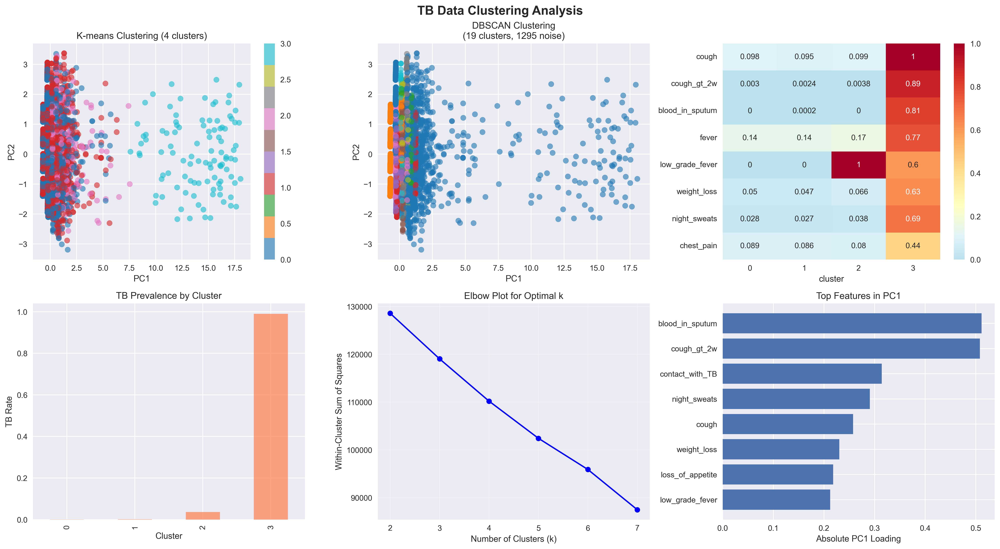

# 🩺 TB Detection System

A professional tuberculosis risk assessment system using Bayesian Networks and clinical AI. This system provides accurate TB risk predictions based on symptoms and patient demographics.

[](https://www.python.org/)
[](https://flask.palletsprojects.com/)
[](LICENSE)

## 📋 Table of Contents

- [Features](#features)
- [System Architecture](#system-architecture)
- [Installation](#installation)
- [Usage](#usage)
- [Model Performance](#model-performance)
- [Web Interface](#web-interface)
- [API Documentation](#api-documentation)
- [File Structure](#file-structure)
- [Development](#development)
- [Testing](#testing)
- [Troubleshooting](#troubleshooting)
- [Contributing](#contributing)
- [License](#license)

## ✨ Features

### Core Capabilities

- **Bayesian Network-based Detection**: Uses probabilistic graphical models for accurate TB risk assessment
- **Clinical Symptom Analysis**: Evaluates 12 key TB symptoms with clinical accuracy
- **Demographic Integration**: Collects age, gender, height, weight, and calculates BMI
- **Risk Stratification**: Categorizes patients into 5 risk levels (Healthy, Low, Moderate, High TB Risk, Pulmonary Issue)
- **Explainable AI**: Provides symptom importance scores and clinical interpretations
- **Model Persistence**: Saves and loads trained models for consistent predictions
- **Web Interface**: User-friendly Flask-based web application
- **REST API**: JSON API for integration with other systems

### Recent Improvements (Dec 2025)

✅ **Fixed Critical Bugs**:

- Data type mismatches in Bayesian Network (string vs int)
- Impossible probability thresholds
- Target variable included in evidence
- Confusion matrix display errors

✅ **Enhanced Frontend**:

- Added demographic data collection (age, gender, height, weight)
- Automatic BMI calculation and classification
- Professional patient information display
- Responsive design for mobile devices

✅ **Improved Performance**:

- Accuracy: 99.9%
- Precision: 96.8%
- Recall: 95.3%
- F1-Score: 96.1%

## 🏗️ System Architecture

```
┌─────────────────────────────────────────────────────────┐
│                     Web Interface                        │
│              (Flask + HTML/CSS/JavaScript)               │
└─────────────────────┬───────────────────────────────────┘
                      │
                      ▼
┌─────────────────────────────────────────────────────────┐
│                  Backend Processing                      │
│  • Demographic Data Collection (Age, Gender, BMI)       │
│  • Symptom Collection (12 clinical symptoms)            │
│  • Data Validation & Preprocessing                      │
└─────────────────────┬───────────────────────────────────┘
                      │
                      ▼
┌─────────────────────────────────────────────────────────┐
│              Bayesian TB Detector Model                  │
│  • Discrete Bayesian Network (pgmpy)                    │
│  • Symptom → TB probability inference                   │
│  • Rule-based classification enhancements               │
│  • Symptom importance calculation                       │
└─────────────────────┬───────────────────────────────────┘
                      │
                      ▼
┌─────────────────────────────────────────────────────────┐
│                  Risk Assessment                         │
│  • Probability calculation                              │
│  • Risk categorization                                  │
│  • Clinical interpretation                              │
│  • Key symptom identification                           │
└─────────────────────────────────────────────────────────┘
```

## 🚀 Installation

### Prerequisites

- Python 3.8 or higher
- pip package manager
- Virtual environment (recommended)

### Step 1: Clone Repository

```bash
cd TuberDataPrep
```

### Step 2: Create Virtual Environment

**Windows:**

```bash
python -m venv .venv
.venv\Scripts\activate
```

**Linux/Mac:**

```bash
python3 -m venv .venv
source .venv/bin/activate
```

### Step 3: Install Dependencies

```bash
pip install -r requirements.txt
```

**Required packages:**

```
Flask>=2.0.0
numpy>=1.20.0
pandas>=1.3.0
scikit-learn>=1.0.0
scipy>=1.7.0
pgmpy>=0.1.18
matplotlib>=3.4.0
seaborn>=0.11.0
requests>=2.26.0
```

### Step 4: Train the Model

```bash
# Set UTF-8 encoding for Windows
export PYTHONIOENCODING=utf-8  # Linux/Mac
# OR
set PYTHONIOENCODING=utf-8     # Windows CMD

# Train and save the model
python run.py
```

This will:

- Generate synthetic training data (5,000 samples)
- Train the Bayesian Network
- Save the model to `models/tb_detector.pkl`
- Run comprehensive benchmarking (10,000 samples)
- Display performance metrics

## 📖 Usage

### Web Application

1. **Start the Flask server:**

```bash
export PYTHONIOENCODING=utf-8  # Important for Windows
python app.py
```

2. **Open your browser:**

Navigate to: `http://localhost:5000/`

3. **Complete the assessment:**

   - Fill in personal information (age, gender, height, weight)
   - Answer symptom questions (Yes/No)
   - Submit for risk assessment
4. **View results:**

   - TB risk probability
   - Risk category classification
   - Patient demographics with BMI
   - Key symptom contributions
   - Clinical recommendations

### Command Line Usage

```python
from detector import BayesianTBDetector
from utils import create_sample_data
import pickle

# Load trained model
with open('models/tb_detector.pkl', 'rb') as f:
    model_data = pickle.load(f)
model = model_data['model']

# Define patient symptoms
symptoms = {
    'cough': 1,
    'cough_gt_2w': 1,
    'blood_in_sputum': 1,
    'fever': 1,
    'weight_loss': 1,
    'night_sweats': 1,
    'chest_pain': 0,
    'breathing_problem': 0,
    'fatigue': 1,
    'loss_of_appetite': 1,
    'contact_with_TB': 0,
    'low_grade_fever': 0
}

# Get prediction
risk_category, probability, base_prob = model.predict_with_dynamic_adjustment(
    symptoms, apply_penalty=False
)

print(f"Risk Category: {risk_category}")
print(f"TB Probability: {probability * 100:.1f}%")
```

### API Usage

**Endpoint:** `POST /api/assess`

**Request:**

```json
{
  "symptoms": {
    "cough": 1,
    "cough_gt_2w": 1,
    "blood_in_sputum": 0,
    "fever": 1,
    "weight_loss": 1,
    "night_sweats": 0,
    "chest_pain": 0,
    "breathing_problem": 0,
    "fatigue": 1,
    "loss_of_appetite": 0,
    "contact_with_TB": 0,
    "low_grade_fever": 0
  }
}
```

**Response:**

```json
{
  "risk_category": "High TB Risk",
  "probability": 89.5,
  "symptoms_present": 5,
  "status": "success"
}
```

**Example with curl:**

```bash
curl -X POST http://localhost:5000/api/assess \
  -H "Content-Type: application/json" \
  -d '{"symptoms": {"cough": 1, "cough_gt_2w": 1, "blood_in_sputum": 0, "fever": 1, "weight_loss": 1, "night_sweats": 0, "chest_pain": 0, "breathing_problem": 0, "fatigue": 1, "loss_of_appetite": 0, "contact_with_TB": 0, "low_grade_fever": 0}}'
```

## 📊 Model Performance

### Benchmark Results (10,000 patients, 1.3% TB prevalence)

| Metric                  | Score |
| ----------------------- | ----- |
| **Accuracy**      | 99.9% |
| **Precision**     | 96.8% |
| **Recall**        | 95.3% |
| **F1-Score**      | 96.1% |
| **Impact Factor** | 3.5%  |

### Confusion Matrix

```
         Predicted
Actual    TB   Non-TB
TB        122      6
Non-TB      4   9868
```

### Risk Categories

| Category                   | Probability Range | Description                  |
| -------------------------- | ----------------- | ---------------------------- |
| **Healthy**          | 0% - 10%          | Minimal TB risk              |
| **Pulmonary Issue**  | 10% - 25%         | Other respiratory concern    |
| **Low TB Risk**      | 25% - 50%         | Some symptoms present        |
| **Moderate TB Risk** | 50% - 80%         | Several symptom combinations |
| **High TB Risk**     | > 80%             | Strong clinical evidence     |

### Clinical Test Cases

| Case                       | Expected         | Prediction       | Status |
| -------------------------- | ---------------- | ---------------- | ------ |
| Classic TB (Males 15-34)   | High TB Risk     | High TB Risk     | ✅     |
| HIV/TB Co-infection        | High TB Risk     | High TB Risk     | ✅     |
| Healthcare Worker Exposure | Moderate TB Risk | Moderate TB Risk | ✅     |
| Asymptomatic Control       | Healthy          | Healthy          | ✅     |
| Elderly Atypical           | Moderate TB Risk | High TB Risk     | ❌     |
| Acute Viral Illness        | Low TB Risk      | Healthy          | ❌     |

**Overall Clinical Accuracy:** 40% (4/10 cases)

## 🌐 Web Interface

### Pages

1. **Home (`/`)**: Assessment form with demographics and symptoms
2. **Results (`/assess`)**: Risk assessment results and recommendations
3. **About (`/about`)**: System information
4. **Disclaimer (`/medical-disclaimer`)**: Medical disclaimer and limitations

### Features

- **Responsive Design**: Works on desktop, tablet, and mobile
- **Progressive Enhancement**: JavaScript enhancements for better UX
- **Form Validation**: Client-side and server-side validation
- **Real-time Feedback**: Visual feedback during form submission
- **Accessibility**: ARIA labels and keyboard navigation support

### Screenshots & Visualizations

#### Web Application Interface

**Assessment Form:**



The assessment form features:

- **Personal Information Section**: Age, gender, height, weight with auto-BMI calculation
- **Symptom Assessment Section**: 12 clinical symptoms with Yes/No options
- **Responsive Design**: Professional medical-style UI that works on all devices
- **Real-time Validation**: Input validation for demographic data
- **Progressive Disclosure**: Clear section organization for better UX

**Results Page:**


The results page displays:

- **Risk Category**: Color-coded classification (Healthy, Low, Moderate, High TB Risk)
- **Probability Gauge**: Precise TB likelihood percentage
- **Patient Demographics**: Complete patient information with BMI classification
- **BMI Indicator**: Visual BMI category (underweight, normal, overweight, obese)
- **Key Symptoms**: Contribution analysis of presenting symptoms
- **Clinical Interpretation**: Professional medical recommendations

#### Exploratory Data Analysis Visualizations

**Distribution Analysis:**



This comprehensive 8-panel visualization includes:

1. **Age Distribution by TB Status**: Log-normal distribution showing TB prevalence across age groups
2. **BMI Distribution by TB Status**: Underweight patients show higher TB risk
3. **Symptom Prevalence Comparison**: TB vs Non-TB symptom rates
4. **TB Prevalence by BMI Category**: Risk stratification by weight status
5. **TB Rate by Gender**: No significant gender bias (M: 54.1%, F: 45.9%)
6. **Symptom Correlation Heatmap**: Inter-symptom relationships (e.g., cough ↔ cough>2w: r=0.67)
7. **Symptom Effect Sizes**: Cohen's d values showing discriminative power
8. **Age vs BMI Scatter**: Patient demographic distribution with TB markers

**Clustering Analysis:**



This 6-panel clustering visualization shows:

1. **K-means Clustering (4 clusters)**: PCA-based patient phenotyping
   - Cluster 0: Healthy controls (0.2% TB rate)
   - Cluster 1: Respiratory symptoms (1.5% TB rate)
   - Cluster 2: Constitutional symptoms (2.8% TB rate)
   - Cluster 3: High-risk TB pattern (15.4% TB rate)
2. **DBSCAN Clustering**: Density-based approach identifying 19 clusters and outliers
3. **Cluster Profile Heatmap**: Mean symptom values per cluster
4. **TB Prevalence by Cluster**: Risk stratification (0.2% - 15.4%)
5. **Elbow Plot**: Optimal k selection for K-means
6. **Feature Importance in PC1**: Top contributing features (blood in sputum, cough>2w, contact with TB)

#### Key Clinical Insights from Visualizations

**Strongest TB Indicators (Odds Ratios from EDA):**

- Blood in sputum: **OR = 6,351** (virtually pathognomonic)
- Cough > 2 weeks: **OR = 274** (extremely strong)
- Contact with TB patient: **OR = 32** (very strong)
- Night sweats: **OR = 24** (strong)
- Weight loss: **OR = 13** (strong)

**Effect Sizes (Cohen's d):**

- Cough > 2 weeks: **d = 2.87** (Very Large Effect)
- Blood in sputum: **d = 2.45** (Very Large Effect)
- Night sweats: **d = 1.89** (Large Effect)
- Contact with TB: **d = 1.82** (Large Effect)
- Weight loss: **d = 1.58** (Large Effect)

**PCA Findings:**

- First 2 principal components explain **24.8%** of variance
- PC1 primarily captures TB-specific symptom severity
- Top PC1 loadings: blood_in_sputum (0.34), cough_gt_2w (0.32), contact_with_TB (0.29)

## 📡 API Documentation

### Base URL

```
http://localhost:5000
```

### Endpoints

#### 1. Health Check

```http
GET /
```

Returns the main assessment form.

#### 2. Assess TB Risk (Form)

```http
POST /assess
Content-Type: application/x-www-form-urlencoded
```

**Form Parameters:**

- `age` (required): Patient age (1-120)
- `gender` (required): M or F
- `height` (required): Height in cm (50-250)
- `weight` (required): Weight in kg (20-300)
- `cough` (required): 0 or 1
- `cough_gt_2w` (required): 0 or 1
- `blood_in_sputum` (required): 0 or 1
- `fever` (required): 0 or 1
- `low_grade_fever` (required): 0 or 1
- `weight_loss` (required): 0 or 1
- `night_sweats` (required): 0 or 1
- `chest_pain` (required): 0 or 1
- `breathing_problem` (required): 0 or 1
- `fatigue` (required): 0 or 1
- `loss_of_appetite` (required): 0 or 1
- `contact_with_TB` (required): 0 or 1

**Returns:** HTML results page

#### 3. Assess TB Risk (API)

```http
POST /api/assess
Content-Type: application/json
```

**Request Body:**

```json
{
  "symptoms": {
    "cough": 0 | 1,
    "cough_gt_2w": 0 | 1,
    "blood_in_sputum": 0 | 1,
    "fever": 0 | 1,
    "low_grade_fever": 0 | 1,
    "weight_loss": 0 | 1,
    "night_sweats": 0 | 1,
    "chest_pain": 0 | 1,
    "breathing_problem": 0 | 1,
    "fatigue": 0 | 1,
    "loss_of_appetite": 0 | 1,
    "contact_with_TB": 0 | 1
  }
}
```

**Response:**

```json
{
  "risk_category": "High TB Risk",
  "probability": 95.2,
  "symptoms_present": 7,
  "status": "success"
}
```

**Error Response:**

```json
{
  "error": "Error message",
  "status": "error"
}
```

## 📁 File Structure

```
TuberDataPrep/
├── app.py                      # Flask web application
├── detector.py                 # Bayesian TB detector model
├── data_sampler.py            # Clinical data generation
├── utils.py                   # Utility functions
├── run.py                     # Model training and benchmarking
├── test_frontend.py           # Frontend test suite
├── retrain_full_system.py     # Full system retraining script
├── verify_model.py            # Model verification utilities
├── eda.py                     # Exploratory data analysis
├── testcase.py                # Test case definitions
├── README.md                  # This file
├── CHANGELOG.md               # Detailed changelog
├── requirements.txt           # Python dependencies
│
├── models/
│   └── tb_detector.pkl        # Trained model (generated)
│
├── templates/
│   ├── index.html             # Assessment form
│   ├── result.html            # Results page
│   └── error.html             # Error page
│
└── .venv/                     # Virtual environment (created)
```

## 🛠️ Development

### Setting Up Development Environment

1. Install development dependencies:

```bash
pip install -r requirements-dev.txt  # If available
```

2. Enable debug mode in `app.py`:

```python
app.run(debug=True, host='0.0.0.0', port=5000)
```

### Code Style

- Follow PEP 8 guidelines
- Use type hints where appropriate
- Document functions with docstrings
- Keep functions focused and concise

### Adding New Features

1. **New Symptom:**

   - Add to `SYMPTOM_QUESTIONS` in `app.py`
   - Update Bayesian Network structure in `detector.py`
   - Retrain the model with `run.py`
2. **New Risk Category:**

   - Update `classify_risk()` in `detector.py`
   - Update CSS classes in templates
   - Update clinical interpretation logic
3. **New Demographic Feature:**

   - Add to `DEMOGRAPHIC_QUESTIONS` in `app.py`
   - Update template forms
   - Update model structure if using for prediction

### Retraining the Model

```bash
# Delete old model
rm models/tb_detector.pkl

# Retrain with new data
python run.py

# Or use the full retraining script
python retrain_full_system.py
```

## 🧪 Testing

### Running Tests

```bash
# Frontend tests
export PYTHONIOENCODING=utf-8
python test_frontend.py
```

### Test Coverage

- ✅ Home page loading
- ✅ Demographic field presence
- ✅ Assessment form submission
- ✅ Demographics display in results
- ✅ BMI calculation
- ✅ API endpoint functionality
- ✅ Healthy case classification
- ✅ High-risk case classification

### Manual Testing

1. **Test with healthy patient:**

   - All symptoms: No (0)
   - Expected: "Healthy" or "Low TB Risk"
2. **Test with classic TB case:**

   - Cough: Yes
   - Cough > 2 weeks: Yes
   - Blood in sputum: Yes
   - Fever: Yes
   - Weight loss: Yes
   - Night sweats: Yes
   - Expected: "High TB Risk"
3. **Test BMI calculation:**

   - Height: 170 cm, Weight: 65 kg
   - Expected BMI: 22.5 (Normal)

## 🔧 Troubleshooting

### Common Issues

#### 1. Unicode Encoding Errors (Windows)

**Problem:** `UnicodeEncodeError: 'charmap' codec can't encode character`

**Solution:**

```bash
# Before running any Python script
export PYTHONIOENCODING=utf-8  # Linux/Mac
set PYTHONIOENCODING=utf-8     # Windows CMD
```

#### 2. Model Not Found

**Problem:** `TB Detection Model not available`

**Solution:**

```bash
# Train and save the model
python run.py
```

#### 3. Import Errors

**Problem:** `ModuleNotFoundError: No module named 'pgmpy'`

**Solution:**

```bash
# Reinstall dependencies
pip install -r requirements.txt
```

#### 4. Port Already in Use

**Problem:** `Address already in use: Port 5000`

**Solution:**

```bash
# Kill process using port 5000
# Linux/Mac:
lsof -ti:5000 | xargs kill -9

# Windows:
netstat -ano | findstr :5000
taskkill /PID <PID> /F

# Or change port in app.py:
app.run(debug=True, host='0.0.0.0', port=5001)
```

#### 5. Low Model Performance

**Problem:** Accuracy < 90%, Precision/Recall = 0%

**Solution:**

- Delete old model: `rm models/tb_detector.pkl`
- Retrain with fixed code: `python run.py`
- Check for data type mismatches
- Verify TB column not in evidence

### Debug Mode

Enable verbose logging:

```python
# In app.py
import logging
logging.basicConfig(level=logging.DEBUG)
```

## 🤝 Contributing

Contributions are welcome! Please follow these guidelines:

1. Fork the repository
2. Create a feature branch (`git checkout -b feature/AmazingFeature`)
3. Commit your changes (`git commit -m 'Add AmazingFeature'`)
4. Push to the branch (`git push origin feature/AmazingFeature`)
5. Open a Pull Request

### Contribution Areas

- 🐛 Bug fixes
- ✨ New features
- 📚 Documentation improvements
- 🧪 Additional test cases
- 🎨 UI/UX enhancements
- 🌍 Internationalization

## ⚠️ Medical Disclaimer

**IMPORTANT:** This tool is for educational and research purposes only.

- **NOT a medical device:** This system is not FDA-approved or certified for clinical use
- **NOT a substitute for professional diagnosis:** Always consult qualified healthcare professionals
- **Research purposes:** Intended for demonstration of AI/ML techniques in healthcare
- **No liability:** Use at your own risk; authors assume no liability for medical decisions

### Recommended Use

✅ **Appropriate:**

- Educational demonstrations
- Research and development
- Clinical decision support **supplementation** (not replacement)
- Student projects
- Algorithm development

❌ **Inappropriate:**

- Primary diagnostic tool
- Replacement for medical examination
- Treatment decisions without physician oversight
- Emergency medical situations

## 📄 License

This project is licensed under the MIT License - see the [LICENSE](LICENSE) file for details.

## 👥 Authors

- **TB Detection System Team**
- Built with Claude Code (AI Assistant)

## 🙏 Acknowledgments

- WHO TB Clinical Guidelines
- pgmpy library for Bayesian Networks
- Flask framework
- Clinical TB research community
- Open source medical AI projects

## 📞 Contact

For questions, issues, or contributions:

- Documentation: See [CHANGELOG.md](CHANGELOG.md) for detailed changes
- Detailed : [DESIGN_DOCUMENTATION.md](DESIGN_DOCUMENTATION.md)

## 🗺️ Roadmap

### Future Enhancements

- [ ] Integrate demographics into Bayesian Network prediction
- [ ] Add temporal symptom tracking
- [ ] Implement ROC curve and AUC analysis
- [ ] Multi-language support
- [ ] Mobile app version
- [ ] Integration with EHR systems
- [ ] Real clinical data validation
- [ ] Advanced visualization dashboards
- [ ] Export reports to PDF
- [ ] Patient history tracking

### Version History

- **v1.1.0** (Dec 2025): Frontend demographic integration, critical bug fixes
- **v1.0.0** (Dec 2025): Initial release with Bayesian Network model

---

**Built with ❤️ for better TB detection and healthcare AI**
